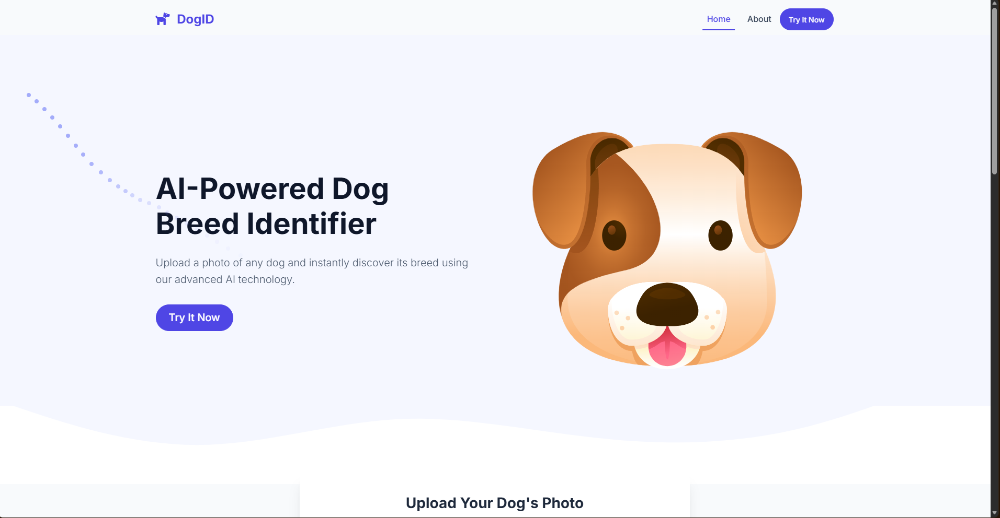
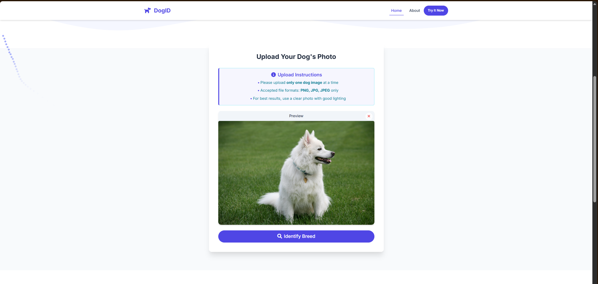

# 🐶 Dog Breed Identification - Preview

A deep learning based web application that identifies dog breeds from uploaded images using EfficientNet and Flask.

---

# 🏠 1. Home Page

The landing page of the application with a clean and user-friendly interface.

---

# 📤 2. Upload Image

Users can upload dog images directly through the web interface for prediction.

---

# ⚙️ 3. Prediction Process

The uploaded image is processed through the trained EfficientNet deep learning model.

---

# 🔍 4. Final Prediction

The application predicts the dog breed and displays the final result with confidence.

---

# 👨‍💻 5. About Section

The website also includes an About section that provides information about the project and the developer behind it.

---

# 🚀 Features

- Dog Breed Classification using EfficientNet
- Flask-based Web Application
- Image Upload Support
- Clean and Simple UI

---

# 📌 Project Goal

The goal of this project is to combine deep learning with a practical web application that allows users to identify dog breeds through image-based predictions.
